<div align="center">

<!-- HERO BANNER - Animated mountain scene with floating runes -->


<br/>

<!-- ANIMATED TYPING -->
<a href="https://git.io/typing-svg"></a>

<br/>

<!-- SOCIAL BADGES -->
[](https://github.com/abuel3ees)
[](https://github.com/abuel3ees)


</div>

<!-- DIVIDER -->


##  &nbsp;The Lore of This Fellowship Member

```
 ╔══════════════════════════════════════════════════════════════════╗
 ║                                                                  ║
 ║   From the fires of the CPU and the ancient halls of Hardware,   ║
 ║   I emerged — a software-wright who binds the fabric of bits     ║
 ║   and bytes into mighty artefacts.                               ║
 ║                                                                  ║
 ╚══════════════════════════════════════════════════════════════════╝
```

<table>
<tr>
<td width="50%" valign="top">

### 🔭 The Quest
Forging full-stack applications and computer architecture in the fires of Mount Compile

### 🌱 The Study
Delving into the ancient magic of GPU sorcery (**CUDA**) and silicon rune-craft (**Verilog**)

### 👯 The Fellowship
Seeking companions for open-source expeditions across web, algorithms, and systems

</td>
<td width="50%" valign="top">

### 💬 Speak, Friend, and Enter
Ask me of **TypeScript**, **React**, **Laravel**, or the **RISC-V** scrolls

### ⚡ A Tale of Legend
I forged a **5-stage pipelined RISC-V processor** from nothing but pure Verilog runes!

### 🎯 Current Campaign
Mastering the dark arts of **parallel computing** and **hardware-software co-design**

</td>
</tr>
</table>

<!-- DIVIDER -->


## 🗡️ The Armoury — Tech Stack of the Realm

> *"Even the smallest person can change the course of the future."*

<div align="center">

<!-- ANIMATED CONSTELLATION -->


</div>

<br/>

<div align="center">

**⚔️ Tongues of the Elves & Men** *(Languages)*

<br/>

<a href="#"></a>
<a href="#"></a>
<a href="#"></a>
<a href="#"></a>
<a href="#"></a>
<a href="#"></a>
<a href="#"></a>

<br/><br/>

**🛡️ Tools Forged in the Fires of Mordor** *(Frameworks & Tools)*

<br/>

<a href="#"></a>
<a href="#"></a>
<a href="#"></a>
<a href="#"></a>
<a href="#"></a>
<a href="#"></a>

</div>

<!-- DIVIDER -->


## 📊 The Palantír — GitHub Stats

> *Gaze into the seeing-stone and behold the chronicle of deeds...*

<div align="center">

<!-- ANIMATED ACTIVITY GRAPH -->


<br/><br/>

<a href="https://github.com/abuel3ees">
  
</a>
<a href="https://github.com/abuel3ees">
  
</a>

<br/><br/>

<!-- STREAK STATS -->
<a href="https://github.com/abuel3ees">
  
</a>

<br/><br/>

<!-- TROPHY -->
<a href="https://github.com/abuel3ees">
  
</a>

</div>

<!-- DIVIDER -->


## 🏰 The Great Works — Featured Projects of the Age

<div align="center">


> *"It's a dangerous business, going out your door... but all the best projects start that way."*

</div>

<br/>

<div align="center">

<!-- PROJECT CARDS as a visual table with emojis and links -->

<table>
<tr>
<td align="center" width="33%">

### ⚙️ [cpu](https://github.com/abuel3ees/cpu)
**The Iron Forge**

A RISC-V 5-stage pipelined processor, wrought like Glamdring itself

`Verilog` `Hardware` `RISC-V`


</td>
<td align="center" width="33%">

### 🏛️ [GRC-APP-REACT](https://github.com/abuel3ees/GRC-APP-REACT)
**The White Council's Tome**

Governance, Risk & Compliance — the wisdom of the Wise

`TypeScript` `React`


</td>
<td align="center" width="33%">

### 📚 [laravel-cms](https://github.com/abuel3ees/laravel-cms)
**Library of Minas Tirith**

A content management system for the keepers of knowledge

`PHP` `Laravel`


</td>
</tr>
<tr>
<td align="center" width="33%">

### 🗺️ [vrp-app](https://github.com/abuel3ees/vrp-app)
**Paths of the Dead**

A Vehicle Routing Problem solver — finding the way when all hope is lost

`Python` `Algorithms`


</td>
<td align="center" width="33%">

### 🎵 [smoodify](https://github.com/abuel3ees/smoodify)
**Songs of the Ainur**

A mood-based music experience — the music of creation

`TypeScript` `Web`


</td>
<td align="center" width="33%">

### 🔮 Coming Soon
**The Next Quest**

*A new artefact stirs in the deep...*

`???`


</td>
</tr>
</table>

</div>

<!-- DIVIDER -->


## 🐍 The Contribution Serpent

<div align="center">

<picture>
  <source media="(prefers-color-scheme: dark)" srcset="https://raw.githubusercontent.com/abuel3ees/abuel3ees/output/github-snake-dark.svg" />
  <source media="(prefers-color-scheme: light)" srcset="https://raw.githubusercontent.com/abuel3ees/abuel3ees/output/github-snake.svg" />
  
</picture>

*Set up with [snk](https://github.com/Platane/snk) GitHub Action to auto-generate!*

</div>

<!-- DIVIDER -->


## 📡 The Beacons of Gondor — Connect With Me

<div align="center">

*The beacons are lit! Gondor calls for aid!*

<br/>

[](https://linkedin.com/in/abuel3ees)
[](https://x.com/abuel3ees)
[](mailto:your@email.com)
[](https://abuel3ees.dev)

</div>

<!-- DIVIDER -->


<!-- FOOTER -->
<div align="center">


<br/>

<sub>⚡ Crafted with obsession by a wizard who codes — last updated March 2026</sub>

<br/><br/>


</div>
