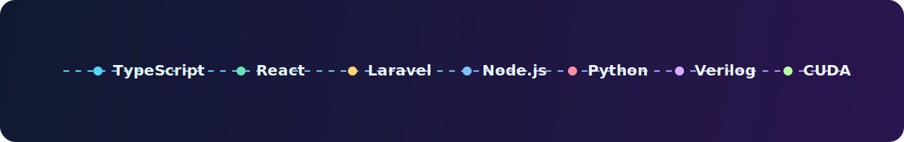

<div align="center">


<br/>

> *"Not all those who wander are lost."* — J.R.R. Tolkien

### *A wanderer of the digital realm, forging artefacts of logic and light*

</div>

---

<div align="center">

```
             .
          .´     `.
        .´    🧙    `.
       /   ~~~~~~~~~~~~\
      |   ONE CODEBASE  |
      |   TO RULE THEM  |
      |       ALL       |
       \   ~~~~~~~~~~~~/
        `.           .´
          `._______.'
```

</div>

---

## 📜 The Lore of This Fellowship Member

*From the fires of the CPU and the ancient halls of Hardware, I emerged — a software-wright who binds the fabric of bits and bytes into mighty artefacts.*

- 🔭 **The Quest:** Forging full-stack applications and computer architecture in the fires of Mount Compile
- 🌱 **The Study:** Delving into the ancient magic of GPU sorcery (CUDA) and silicon rune-craft (Verilog)
- 👯 **The Fellowship:** Seeking companions for open-source expeditions across web, algorithms, and systems
- 💬 **Speak, Friend, and Enter:** Ask me of TypeScript, React, Laravel, or the RISC-V scrolls
- ⚡ **A Tale of Legend:** I forged a 5-stage pipelined RISC-V processor from nothing but pure Verilog runes!

---

## 🗡️ The Armoury — Tech Stack of the Realm

*"Even the smallest person can change the course of the future."*

<div align="center">
  
</div>

**⚔️ Tongues of the Elves & Men** *(Languages)*


**🛡️ Tools Forged in the Fires of Mordor** *(Frameworks & Tools)*


---

## 📊 The Palantír — GitHub Stats

*Gaze into the seeing-stone and behold the chronicle of deeds...*


---

## 🏰 The Great Works — Featured Projects of the Age

*"It's a dangerous business, going out your door... but all the best projects start that way."*

| ⚔️ Artefact | 📖 The Legend | 🔮 Runes Used |
|-------------|---------------|---------------|
| [cpu](https://github.com/abuel3ees/cpu) | The Iron Forge — a RISC-V 5-stage pipelined processor, wrought like Glamdring itself | Verilog |
| [GRC-APP-REACT](https://github.com/abuel3ees/GRC-APP-REACT) | The White Council's Governance, Risk & Compliance tome | TypeScript / React |
| [laravel-cms](https://github.com/abuel3ees/laravel-cms) | The Library of Minas Tirith — a content management system | PHP / Laravel |
| [vrp-app](https://github.com/abuel3ees/vrp-app) | The Paths of the Dead — a Vehicle Routing Problem solver | Python |
| [smoodify](https://github.com/abuel3ees/smoodify) | The Songs of the Ainur — a mood-based music experience | TypeScript |

---

<div align="center">

*"All we have to decide is what to do with the time that is given us."*

🌋 **May your builds never fail and your PRs always be merged.** 🌋

</div>
