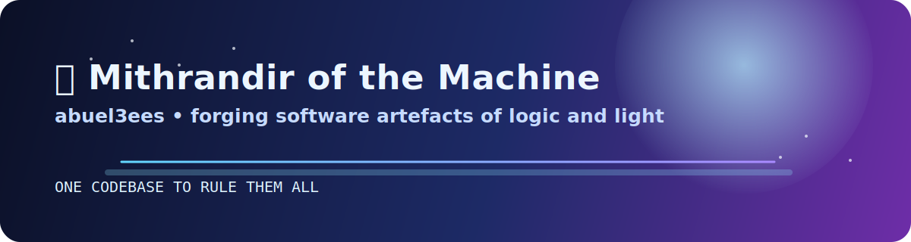

<div align="center">

<!-- ═══════════════════════════════════════════════════ -->
<!-- THE GATES OF MORIA — Hero Banner                   -->
<!-- ═══════════════════════════════════════════════════ -->



<br/>

<!-- Animated typing in Tolkien style -->
<a href="https://git.io/typing-svg"></a>

<br/>

<!-- Badges styled in Middle-earth palette -->
[](https://github.com/abuel3ees)
[](https://github.com/abuel3ees)


</div>

<!-- ═══════════════════════════════════════════════════ -->

<!-- ═══════════════════════════════════════════════════ -->

<div align="center">


</div>

<!-- ═══════════════════════════════════════════════════ -->

<!-- ═══════════════════════════════════════════════════ -->

## 📜 The Red Book of Westmarch — Who I Am

> *"From the fires of the CPU and the ancient halls of Hardware, I emerged — a software-wright who binds the fabric of bits and bytes into mighty artefacts."*

<table>
<tr><td width="50%" valign="top">

### 🔭 The Quest

Forging full-stack applications and computer architecture in the fires of **Mount Compile**. I walk between two worlds — the realm of **web applications** and the deep mines of **hardware design**.

### 🌱 The Study of Ancient Arts

Delving into the forgotten magic of **GPU sorcery** (CUDA) and **silicon rune-craft** (Verilog) — arts as old as the First Age of Computing.

### 👯 Seeking the Fellowship

Looking for companions to join open-source expeditions across the realms of web, algorithms, and systems.

</td><td width="50%" valign="top">

### 💬 Speak, Friend, and Enter

*Pedo mellon a minno.* Ask me of **TypeScript**, **React**, **Laravel**, or the sacred **RISC-V scrolls**.

### ⚡ A Tale Worthy of the Elder Days

I forged a **5-stage pipelined RISC-V processor** from nothing but pure Verilog runes — a feat that would make even the smiths of Eregion proud.

### 🎯 The Current Campaign

Mastering the dark arts of **parallel computing** and **hardware-software co-design** — binding the power of silicon to the will of code.

</td></tr>
</table>

<!-- ═══════════════════════════════════════════════════ -->

<!-- ═══════════════════════════════════════════════════ -->

## 🗡️ A Map of the Armoury — The Realms of My Tech Stack

> *"Even the smallest person can change the course of the future."*

<div align="center">

<!-- THE MAP OF MIDDLE-EARTH (Tech Stack) -->


</div>

<br/>

<div align="center">

**⚔️ The Tongues of the Elves and Men** *(Languages)*

Each tongue carries its own power — from the High Elvish of TypeScript to the Black Speech of Verilog.

<br/>

<a href="#"></a>
<a href="#"></a>
<a href="#"></a>
<a href="#"></a>
<a href="#"></a>
<a href="#"></a>
<a href="#"></a>

<br/><br/>

**🛡️ Weapons Forged in the Fires of Mordor** *(Frameworks & Tools)*

<br/>

<a href="#"></a>
<a href="#"></a>
<a href="#"></a>
<a href="#"></a>

</div>

<!-- ═══════════════════════════════════════════════════ -->

<!-- ═══════════════════════════════════════════════════ -->

## 🔮 The Palantír — GitHub Stats

<div align="center">

<!-- THE EYE OF SAURON (Stats header) -->


<br/><br/>

<a href="https://github.com/abuel3ees">
  
</a>
<a href="https://github.com/abuel3ees">
  
</a>

<br/><br/>

<a href="https://github.com/abuel3ees">
  
</a>

<br/><br/>

<a href="https://github.com/abuel3ees">
  
</a>

</div>

<!-- ═══════════════════════════════════════════════════ -->

<!-- ═══════════════════════════════════════════════════ -->

## 🏰 The Great Works of the Age — Featured Projects

<div align="center">


> *"It's a dangerous business, Frodo, going out your door. You step onto the road, and if you don't keep your feet, there's no knowing where you might be swept off to."*

</div>

<br/>

<div align="center">
<table>
<tr>
<td align="center" width="33%">

### ⚙️ [The Iron Forge](https://github.com/abuel3ees/cpu)

**`cpu`** — A RISC-V 5-stage pipelined processor wrought in the fires of Mount Doom itself. As Glamdring was to Gandalf, so is this processor to me.

`Verilog` · `Hardware` · `RISC-V`


</td>
<td align="center" width="33%">

### 🏛️ [The White Council's Tome](https://github.com/abuel3ees/GRC-APP-REACT)

**`GRC-APP-REACT`** — Governance, Risk & Compliance — the wisdom of the Wise, codified into a web application. Elrond would approve.

`TypeScript` · `React`


</td>
<td align="center" width="33%">

### 📚 [The Library of Minas Tirith](https://github.com/abuel3ees/laravel-cms)

**`laravel-cms`** — A content management system worthy of the great libraries where Gandalf discovered the truth of the One Ring.

`PHP` · `Laravel`


</td>
</tr>
<tr>
<td align="center" width="33%">

### 🗺️ [The Paths of the Dead](https://github.com/abuel3ees/vrp-app)

**`vrp-app`** — A Vehicle Routing Problem solver. Like Aragorn leading the Dead through the mountains, this finds the path when all hope seems lost.

`Python` · `Algorithms`


</td>
<td align="center" width="33%">

### 🎵 [The Music of the Ainur](https://github.com/abuel3ees/smoodify)

**`smoodify`** — A mood-based music experience. Before the world was made, there was the Music — this app channels that primal creative force.

`TypeScript` · `Web`


</td>
<td align="center" width="33%">

### 🌋 The Next Age

**`???`** — *Something stirs in the deep. A new artefact is being forged in secret...*

`Coming Soon`


</td>
</tr>
</table>
</div>

<!-- ═══════════════════════════════════════════════════ -->

<!-- ═══════════════════════════════════════════════════ -->

## 🐙 The Watcher in the Water — Contribution Graph

<div align="center">

*Something lurks beneath the surface of the contribution graph...*

<br/>

<picture>
  <source media="(prefers-color-scheme: dark)" srcset="https://raw.githubusercontent.com/abuel3ees/abuel3ees/output/github-snake-dark.svg" />
  <source media="(prefers-color-scheme: light)" srcset="https://raw.githubusercontent.com/abuel3ees/abuel3ees/output/github-snake.svg" />
  
</picture>

<sub>*Set up with [snk](https://github.com/Platane/snk) — add a GitHub Action to auto-generate!*</sub>

</div>

<!-- ═══════════════════════════════════════════════════ -->

<!-- ═══════════════════════════════════════════════════ -->

## 🔥 The Beacons of Gondor — Connect With Me

<div align="center">

<!-- BEACONS LIGHTING UP -->


<br/><br/>

*The beacons are lit! Will you answer the call?*

<br/>

[](https://linkedin.com/in/abuel3ees)
[](https://x.com/abuel3ees)
[](mailto:your@email.com)
[](https://abuel3ees.dev)

</div>

<!-- ═══════════════════════════════════════════════════ -->

<!-- ═══════════════════════════════════════════════════ -->

## 📖 The Appendices — Character Sheet

<div align="center">

```
                        ____
                       /    \
                      | 🧙  |
                       \____/
                         ||
                    ╔════╧═════╗
                    ║  CLASS:  ║
                    ║ Software ║
                    ║  Wright  ║
                    ║ ──────── ║
                    ║ STR: ███ ║
                    ║ INT: ████║
                    ║ WIS: ███ ║
                    ║ DEX: ██  ║
                    ║ CHA: ███ ║
                    ╚══════════╝
```

</div>

<div align="center">

| 📊 Attribute | 🔮 Value |
|:---|:---|
| **Class** | Software-Wright of the Istari Order |
| **Alignment** | Chaotic Good *(ships fast, fixes faster)* |
| **Primary Weapon** | TypeScript + React |
| **Secondary Weapon** | Verilog + CUDA |
| **Mount** | Git *(swift and reliable)* |
| **Special Ability** | Can forge a pipelined processor from pure runes |
| **Weakness** | Off-by-one errors in the Mines of Moria |
| **Title** | Keeper of the Shire (TypeScript), Lord of Mordor (Verilog) |
| **Quest Status** | ⚔️ **Active** |

</div>

<!-- ═══════════════════════════════════════════════════ -->

<!-- ═══════════════════════════════════════════════════ -->

<!-- THE GREY HAVENS — Footer -->
<div align="center">


<br/>

<sub>*Crafted with the devotion of a Hobbit writing in the Red Book of Westmarch*</sub>

<br/>

<sub>🌋 *May your builds never fail and your PRs always be merged* 🌋</sub>

</div>
